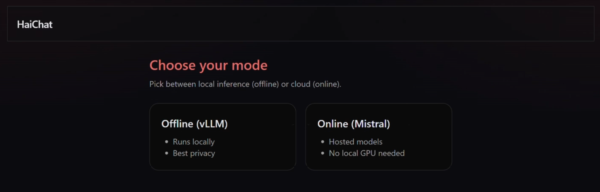
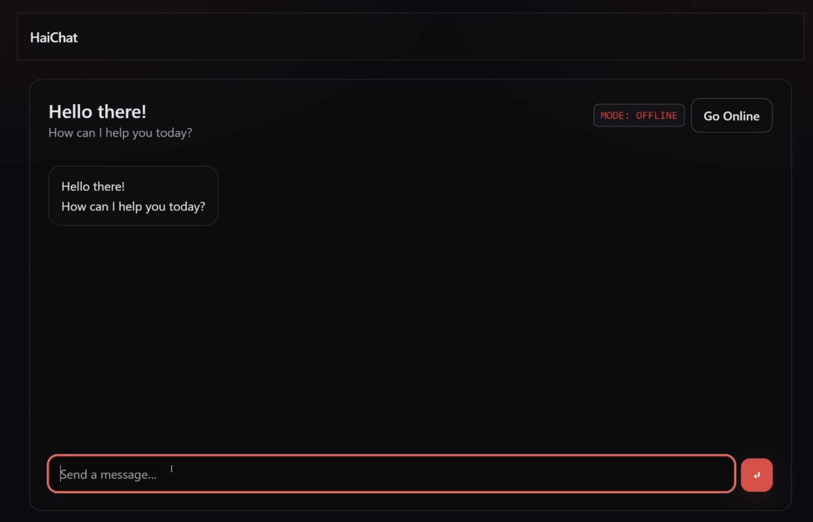
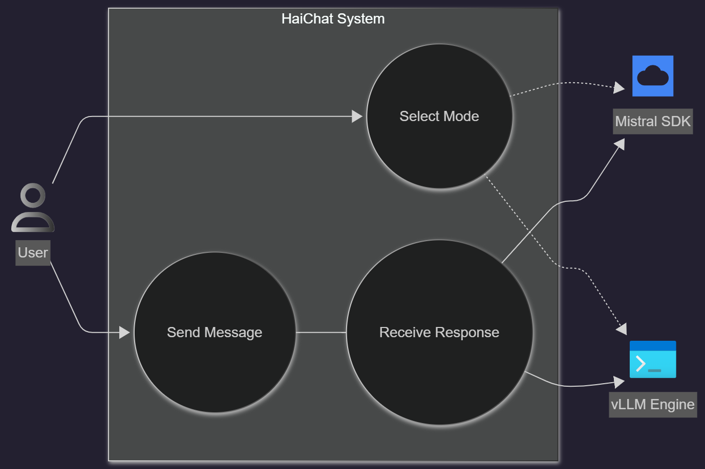

# HaiChat

[]()
[]()
[]()
[](./LICENSE)


## Table of Contents
- [Introduction](#Introduction)
- [Use Case Diagram](#Use-Case-Diagram)
- [High Level Architecture](#High-Level-Architecture)
- [Project Structure](#project-structure)
- [Installation](#installation)


## Introduction

HaiChat (stands for Hybrid AI Chat) is a prototype ChatBot, available in offline and online modes (hence the Hybrid in the name).
The offline mode is build on vLLM and currently using the TinyLlama model (for prototyping purposes), while the online mode operates on Mistral AI SDK.

The idea behind this project is to offer the option for the user to choose whether they need to prioritize their privacy (maybe a company's privacy) and prefer to utilize the power of AI locally, or let them choose the cloud option that saves them compute and resources.

This project was also inspired by the idea of showcasing my AI software engineering skills and practices, ranging from infrastructure setup to coding and prototyping.

## Demo

To view the demo of this project, please visit this <a href = "https://www.youtube.com/watch?v=lV5Juwi_9nU"> Youtube video</a>.

Screenshots:

<p align="center">
  
</p>

<p align="center">
  
</p>


## Use Case Diagram

<p align="center">
  
</p>

## High Level Architecture

<p align="center">
  
</p>

## Project Structure

```bash
.
├── apps/
│   └── chat/              # Next.js frontend (UI for online/offline chat)
│       ├── app/           # Pages and global layout
│       ├── components/    # UI components (Chat, Mode selector, etc.)
│       ├── public/
│       └── Dockerfile
│
├── services/
│   ├── api-online/        # FastAPI backend (Mistral SDK)
│   └── api-offline/       # OpenAI API protocol backend (vLLM local engine)
│
├── bin/                   # Setup scripts
├── docs/                  
│   └── images/
│
├── docker-compose.yml 
├── LICENSE
└── README.md
```

## Installation

### Clone the repository

```bash
git clone https://github.com/1MrazorT1/HaiChat.git
cd HaiChat

```

### Run the setup script

```bash
# Linux / macOS
bash bin/setup.sh

# Windows (PowerShell)
.\bin\setup.ps1

```

### Option A: Start the App with Docker

If you want to run using your CPU:

```bash
docker compose --profile cpu up --build
```

If you want to run using your GPU:

```bash
docker compose --profile gpu up --build
```

### Option B: Run services Manually (Make sure you are in a Python venv) (Requires GPU)

In the first terminal, run:

```bash
vllm serve TinyLlama/TinyLlama-1.1B-Chat-v1.0 --gpu_memory_utilization 0.7 --api_key testingvllm
```

In the second terminal, run:

```bash
cd services/api-online
fastapi dev main.py --port 8090
```

In the third terminal, run:

```bash
cd apps/chat
npm run dev
```

### Launch the app 

```bash
http://localhost:3000
```
